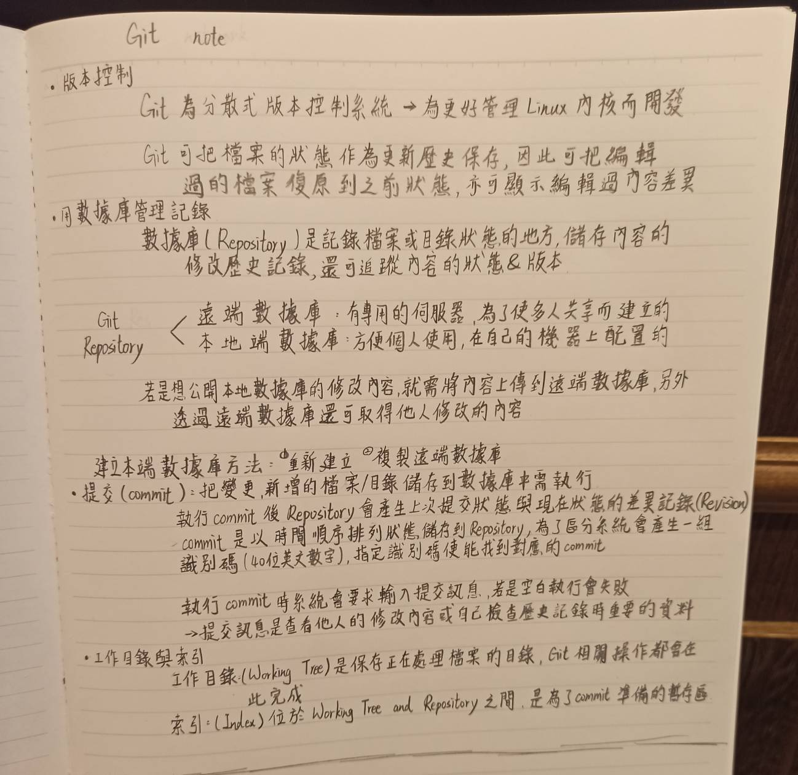

# Learning Note

## 1.環境安裝(以macOS為例)
Install homebrew if you don't already have it, then:
```
$ brew install git
```
homebrew link: https://brew.sh

git link: https://git-scm.com/download/mac

## 2.設定識別資料(User Name & Email)
```
$ git config --global user.name "John"
$ git config --global user.email john@example.com
```
### 檢查設定值:
```
$ git config --list 
```

## 3.終端機指令
MacOS|功能
-----|--------
cd | 切換目錄
pwd | 顯示目前所在資料夾
ls | 目前資料夾的檔案列表
mkdir | 創建資料夾
touch | 建立檔案
cp | 複製檔案
mv | 移動檔案
rm | 刪除檔案
clear | 清除Terminal內容
-------------
## 常用指令：

Main porcelain commands:

git-add[1]: Add file contents to the index

git-branch[1]: List, create, or delete branches

git-checkout[1]: Switch branches or restore working tree files

git-commit[1]: Record changes to the repository

git-init[1]: Create an empty Git repository or reinitialize an existing one

git-log[1]: Show commit logs

git-pull[1]: Fetch from and integrate with another repository or a local branch

git-push[1]: Update remote refs along with associated objects

git-status[1]: Show the working tree status

Ancillary Commands:

git-config[1]: Get and set repository or global options

git-remote[1]: Manage set of tracked repositories

git-replace[1]: Create, list, delete refs to replace objects

Interrogators:

git-help[1]: Display help information about Git

git-whatchanged[1]: Show logs with difference each commit introduces
## 4.分支
### 分支創建:(創建一個可移動的新指針)
```
$ git branch example 
(此命令僅創建新分支並不會自動切換到新分支,可用git log命令查看個分支當前所指的對象)
```
### 分支切換:(切換至一個已存在的分支)
```
$ git checkout example
```
### 查看分叉歷史:
```
$ git log --oneline --decorate --graph --all
(會輸出提交歷史.各分支的指向.項目的分支交叉情況)
```
Git有一個名為HEAD的特殊指針,指向當前所在的本地分支

分支切換會改變工作目錄中的文件！（工作目錄裡的文件會隨著分支切換而改變）

創建新分之同時切換過去可以用 git checkout -b <newbranchname> 命令完成

# 5.合作
## Fork專案:
若要參與一個沒有推送權限的專案時,可以‘Fork'一份,

代表GitHub會複製一份專案副本至自己帳號底下,

並且有全部的權限,可以進行推送

## GitHub設計一個以Pull Request為中心的合作流程:

1.Fork the project

2.Create a topic branch from master

3.Make some commits to impore the project

4.Push this branch to your GitHub project

5.Open a Pull Request on GitHub

6.Discuss, and optionally continue committing

7.The project owner merges or closes the Pull Request

8.Sync the updated master back to your fork

## 參考資料:
1. https://git-scm.com/about

2. https://backlog.com/git-tutorial/tw/intro/intro2_2.html

## 基本介紹:
